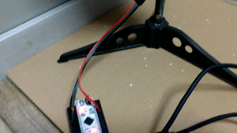

# EmotionalBlink
blink NeoPixel LEDs beautifully.





This is a LED library for Arduino or compatible boards. This library requires [Adafruit NeoPixel Library](https://github.com/adafruit/Adafruit_NeoPixel). Please install it before using this library.

## Installation

Clone this repository to a following directory.

```
 /Users/YOUR_USER_NAME/Documents/Arduino/libraries/
 (for those who use Mac. )
```

Please google "Where to install Arduino additional libraries on Windows PC?" if you use Windows PC.

## How to use

### Request to use a header file in your sketch

Insert a following line to top of your sketch.

```
#include <EmotionalBlink.h>
```

### Call functions

Before call the functions, initialize NeoPixel LEDs.
In this case, the number of LED is just 1. But you can use this library for also multiple LEDs.


```
#define PIN D8
#define NUMLED 1
Adafruit_NeoPixel pixels = Adafruit_NeoPixel(NUMLED, PIN, NEO_RGB + NEO_KHZ800);
```


Call functions like following...

```
// one-time red blinking.
Blink.softly(&pixels, NUMLED, 255, 0, 0);

// one-time green blinking. (a long blink. the duration is 5sec.)
Blink.softly(&pixels, NUMLED, 0, 255, 0, 5000);

// Blink like party people(パリピ) for 1sec. (a random color blinking)
Blink.likePartyPeople(&pixels, NUMLED, 1000);
```

Let's blink. そしてモテよう！


### One More Thing...


**🎄🎄🎄🎄🎄I just added a function for a holiday season!🎄🎄🎄🎄🎄**<br>


Use it like this.

```
#include <Adafruit_NeoPixel.h>
#include <EmotionalBlink.h>

#define PIN 3
#define NUMLED 30
Adafruit_NeoPixel pixels = Adafruit_NeoPixel(NUMLED, PIN, NEO_RGB + NEO_KHZ800); //おまじない

void setup() {
  pixels.begin();
}

void loop() {
  Blink.likeHolidaySeason(&pixels, NUMLED, 1000);
}
```

Just call `Blink.likeHolidaySeason()` and your christmas tree will blink holier.


A HAPPY HOLIDAY!
